# Báo cáo cá nhân — K4-L3B Day 13 Monitoring & LLMOps

## 1. Thông tin học viên

- **Họ và tên:** Lê Văn Sang
- **MSSV:** 2A202602391
- **Lớp:** K4-L3B
- **Repository URL:** https://github.com/sanh1ie77e/K4-L3-DAY13-LeVanSang-2A20602391-Monitoring-LLMOps
- **Commit SHA cuối:** `fb1a244`
- **Challenge ID:** `day13-k4-l3b-monitoring-llmops-v1`
- **Tên project Langfuse cá nhân:** `day13-k4-l3b-2A202602391`

## 2. Evidence index

| Evidence | Đường dẫn |
|---|---|
| Pytest cuối | 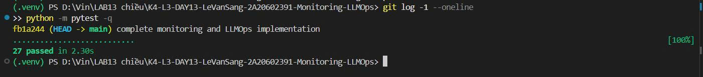 |
| Log validator | 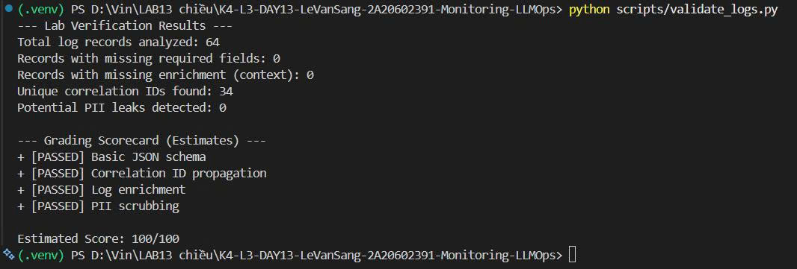 |
| Dashboard validator | 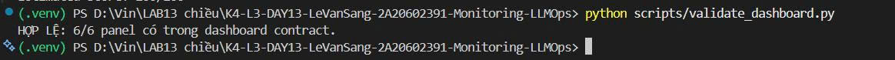 |
| Structured log | 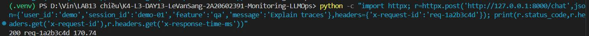 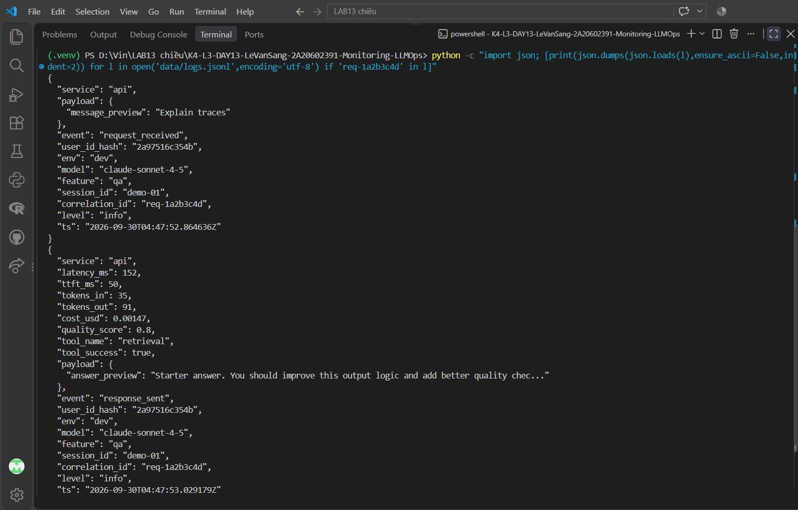 |
| PII redaction | 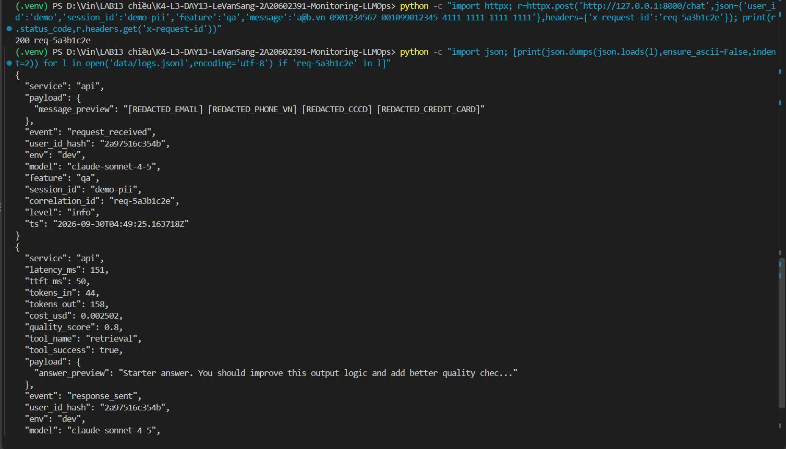 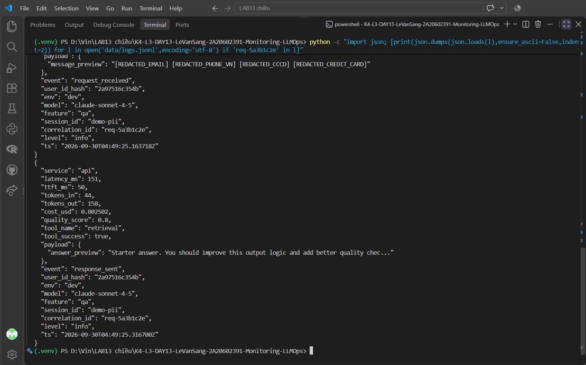 |
| Trace list | 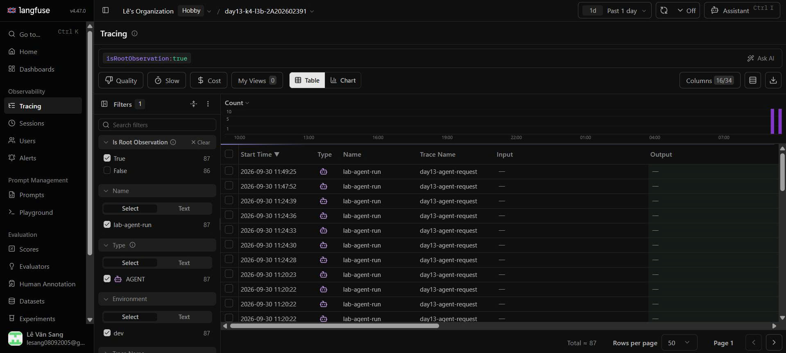 |
| Trace waterfall | 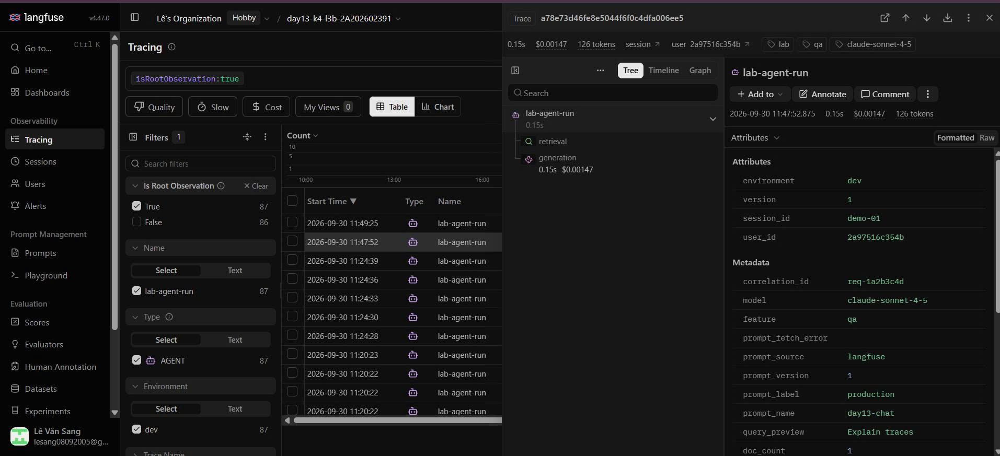 |
| Trace metadata | 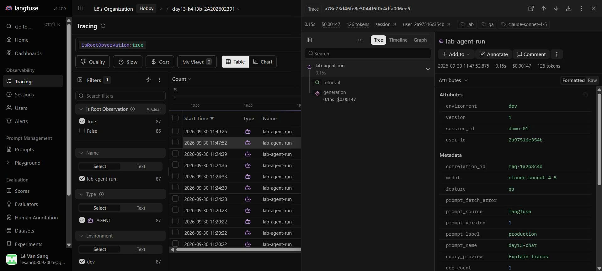 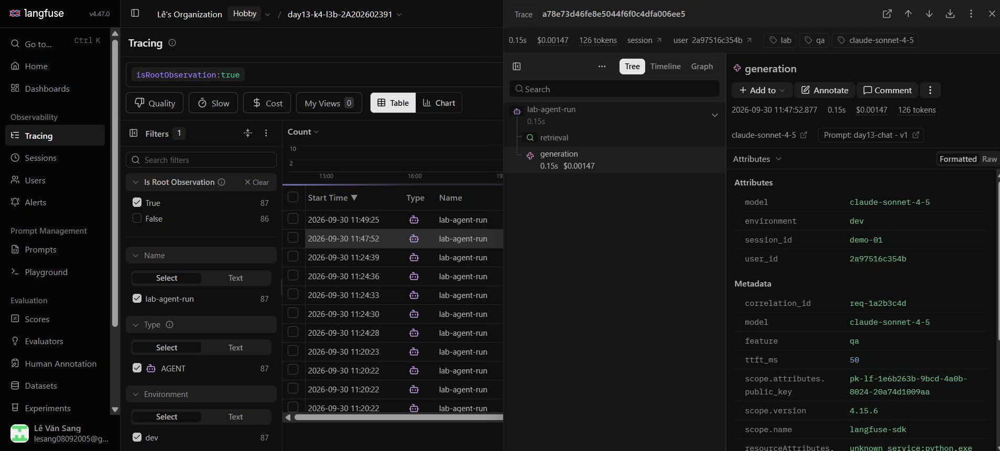 |
| Prompt versions | 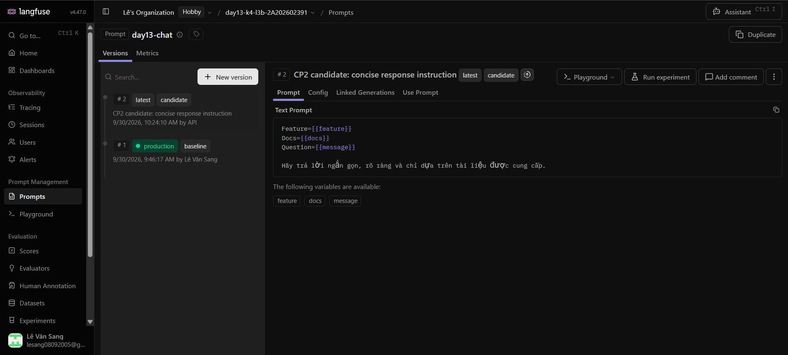 |
| Prompt promote/rollback | 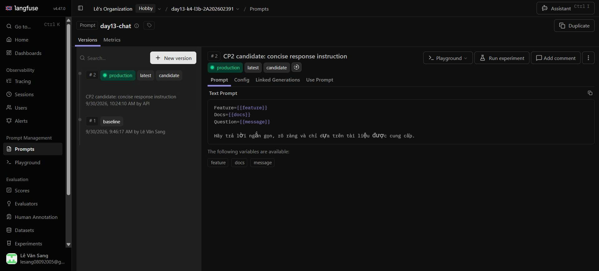 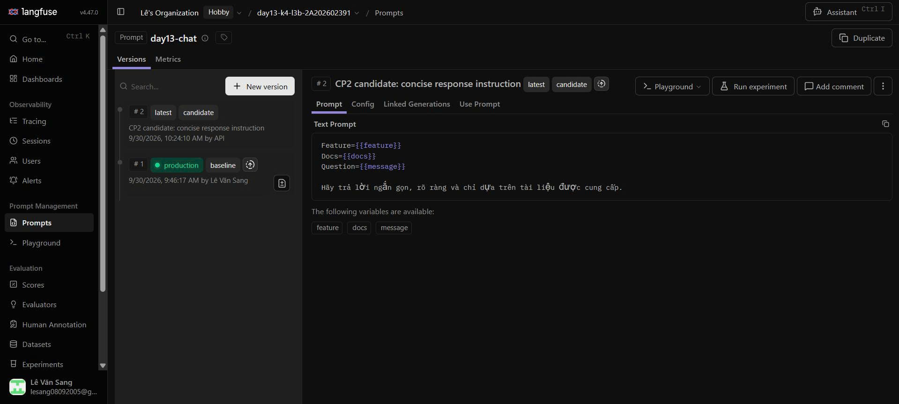 |
| Dashboard runtime | 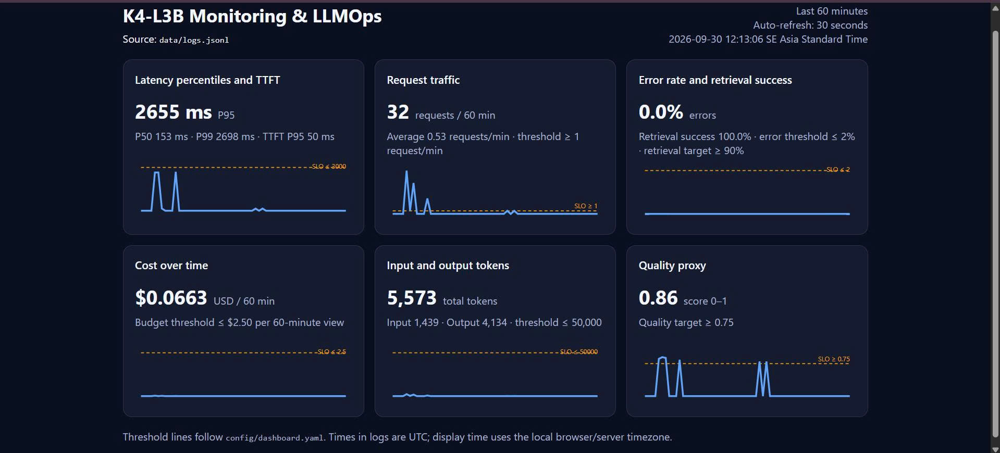 |
| Incident metric | 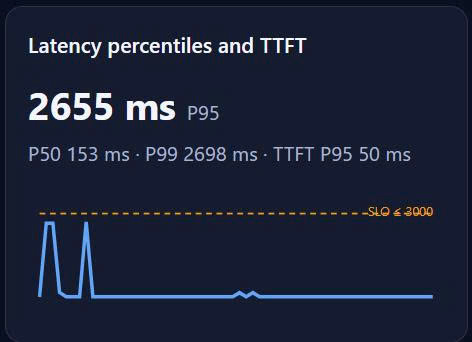 |
| Incident log | 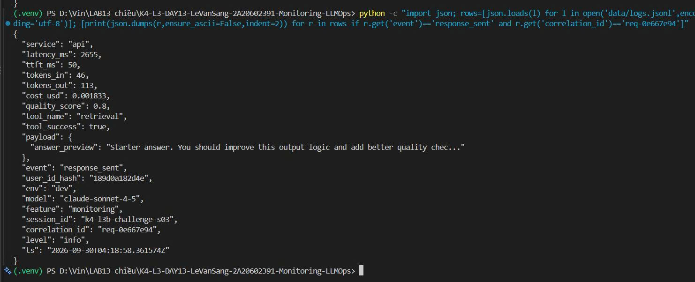 |
| Incident trace | 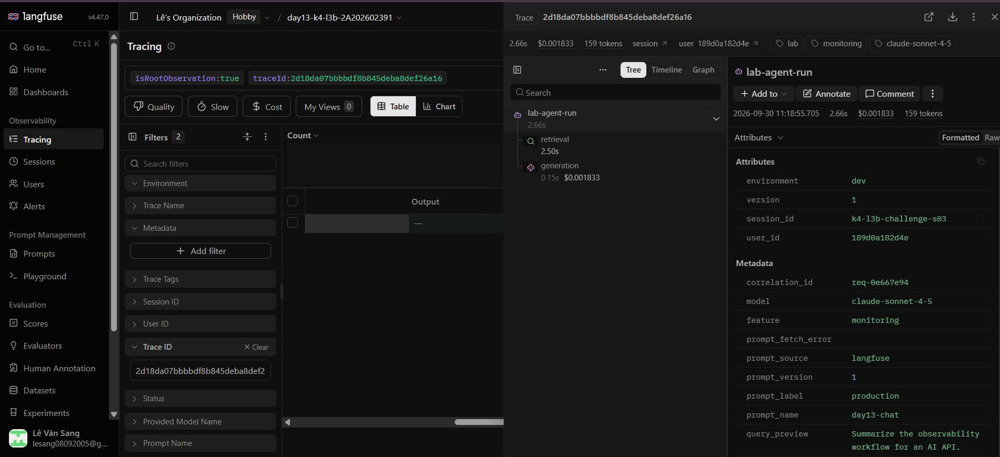 |

## 3. Kết quả kỹ thuật

| Nội dung | Baseline | Kết quả cuối | Nhận xét |
|---|---|---|---|
| `validate_logs.py` | 30/100 | 100/100 | 0 records thiếu schema/enrichment, có correlation ID và 0 PII leak |
| `validate_dashboard.py` | 6/6 | 6/6 | Dashboard contract vẫn đủ sáu panel |
| `pytest` | 22 passed, 2 warnings | 27 passed | Toàn bộ test pass trên commit code `fb1a244` bằng lệnh chuẩn `python -m pytest -q` |
| Số traces hợp lệ | 10 traces chỉ có root | 5/5 traces challenge hợp lệ | Mỗi trace challenge có root `lab-agent-run` và hai child `retrieval`/`generation` |
| Số PII leak | 0 | 0 | PII scrubber che email, điện thoại VN, CCCD và thẻ trước khi ghi log |
| Latency P95 / TTFT P95 | 1119 ms / 50 ms | 153 ms / 50 ms sau phục hồi | Trong incident, latency P95 là 2655 ms; sau khi tắt `rag_slow`, P95 trở về 153 ms |
| Retrieval success rate | Chưa đo | 100% | Retrieval vẫn thành công trong challenge nhưng span bị chậm khoảng 2.5 giây |

### Baseline CP0

API đã chạy tại `http://127.0.0.1:8000`, endpoint `/health` trả `ok: true` và tracing được bật. Workload gần nhất gửi 10 requests, tất cả trả HTTP 200. Langfuse đã nhận 10 traces trong project cá nhân. Kết quả `validate_logs.py` đạt 30/100 là baseline dự kiến vì starter chưa triển khai correlation ID và log enrichment; `validate_dashboard.py` đạt 6/6 và public tests đạt 22/22.

## 4. Logging và PII

- **Cách tạo/nhận và truyền correlation ID:** `CorrelationIdMiddleware` xóa context cũ ở đầu mỗi request, ưu tiên dùng header `x-request-id` do client gửi; nếu header không có thì sinh ID dạng `req-<8 ký tự hex>`. ID được bind vào `structlog` context, lưu tại `request.state.correlation_id`, truyền vào agent/trace, trả trong body `/chat` và response header `x-request-id`. Middleware đồng thời trả thời gian xử lý qua header `x-response-time-ms`.
- **Các metadata được ghi vào structured log:** `correlation_id`, `user_id_hash`, `session_id`, `feature`, `model` và `env` được bind trước event `request_received`, nên các event tiếp theo trong cùng request có chung context. `user_id` không được ghi thô mà được băm SHA-256 và rút gọn còn 12 ký tự.
- **Cách bảo đảm PII được scrub trước khi ghi:** processor `scrub_event` được đặt trước `JsonlFileProcessor` và `JSONRenderer`. Processor duyệt đệ quy string trong dictionary/list/tuple rồi dùng các pattern trong `app/pii.py` để che email, số điện thoại Việt Nam, CCCD và thẻ thanh toán trước khi dữ liệu được serialize hoặc ghi vào `data/logs.jsonl`.
- **Cách kiểm chứng kết quả:** Đã chuyển log baseline ra ngoài repository, restart API và chạy lại workload. Evidence validator ghi nhận `validate_logs.py` đạt 100/100 trên 64 log records: không thiếu required fields, không thiếu enrichment, có 34 correlation ID duy nhất và 0 PII leak. Request không truyền ID trả ID tự sinh giống nhau ở body/header; request truyền ID cũng nhận lại đúng ID ở body/header. Toàn bộ test đạt 27/27, bao gồm test bổ sung cho CCCD và các định dạng thẻ thanh toán.

## 5. Tracing và prompt versioning

- **Cách xác nhận traces do chính tôi tạo trong project cá nhân:** Chạy workload từ repository cá nhân với key của project `day13-k4-l3b-2A202602391`, sau đó đối chiếu session/correlation ID trong log với Observations API v2 và giao diện Langfuse. Đã xác nhận ít nhất 10 trace mới có đủ ba observations.
- **Cấu trúc root/retrieval/generation observations:** Root `lab-agent-run` loại `AGENT` có hai child cùng parent: `retrieval` loại `RETRIEVER` và `generation` loại `GENERATION`. Cả hai decorator đều tắt capture input/output thô. Generation ghi model `claude-sonnet-4-5`, usage input/output/total, cost input/output/total và liên kết tới managed prompt.
- **Cách nối trace với log:** Middleware truyền cùng `correlation_id` vào structured log và `propagate_attributes()` của Langfuse. Trace `a78e73d46fe8e5044f6f0c4dfa006ee5` có `correlation_id=req-1a2b3c4d`, trùng với request trong evidence structured log, waterfall và metadata.
- **Prompt name:** `day13-chat` (Text prompt, giữ đủ biến `{{feature}}`, `{{docs}}`, `{{message}}`).
- **Version/label baseline:** Version 1, labels `baseline` và `production`.
- **Version/label candidate:** Version 2, labels `candidate` và `latest`; thay đổi nhỏ là yêu cầu trả lời ngắn gọn, rõ ràng và chỉ dựa trên tài liệu.
- **Trace ID của mỗi version:** v1/production: `a78e73d46fe8e5044f6f0c4dfa006ee5`; v2/candidate: `88a0650efae9e0893d6a7e22a977379c` (`correlation_id=req-ca1d0003`).
- **Cách promote và rollback `production`:** Ban đầu v1 mang nhãn `baseline` và `production`, còn v2 mang nhãn `candidate` và `latest`. Tôi chuyển nhãn `production` sang v2 để promote và chụp evidence 10a, sau đó chuyển `production` trở lại v1 để rollback và chụp evidence 10b.

## 6. Dashboard, SLO và alerts

- **Dashboard và sáu panel:** Dashboard runtime tại `/dashboard` đọc trực tiếp `data/logs.jsonl`, dùng time range 60 phút và tự refresh 30 giây. Sáu panel gồm Latency P50/P95/P99 + TTFT P95, Traffic, Errors + retrieval success, Cost, Tokens và Quality; mỗi panel hiển thị đơn vị và threshold theo `config/dashboard.yaml`. Snapshot evidence có 32 requests, latency P95 2655 ms trong cửa sổ có incident, TTFT P95 50 ms, error rate 0%, retrieval success 100%, cost $0.0663, 5,573 tokens và quality trung bình 0.86.
- **SLO và lý do chọn:** SLO `fast_successful_requests` yêu cầu 99.5% request trong 28 ngày có event `response_sent` và latency không quá 3000 ms. Ngưỡng 3000 ms cao hơn khoảng 2.7 lần P95 baseline CP0 là 1119 ms, đủ hấp thụ dao động bình thường nhưng vẫn phát hiện suy giảm rõ rệt.
- **Cách tính error budget:** Error budget là `100% - 99.5% = 0.5%`. Với 10,000 requests trong cửa sổ 28 ngày, tối đa `10,000 × 0.5% = 50` request được phép lỗi hoặc chậm hơn 3000 ms.
- **Ba alert và runbook tương ứng:** `HighLatencyP95` (`warning`, P95 > 3000 ms trong 5m), `HighErrorRate` (`critical`, error rate > 2% trong 5m) và `LowRetrievalSuccess` (`warning`, retrieval success < 90% trong 5m). Cả ba gửi Slack `#k4-l3b-alerts`, owner `student-2A202602391`, và có runbook Metrics → Logs → Traces cùng mitigation tại `docs/alerts.md`.

## 7. Điều tra challenge

- **Challenge ID:** `day13-k4-l3b-monitoring-llmops-v1` (incident `rag_slow`, feature bị ảnh hưởng: `monitoring`).
- **Khoảng thời gian điều tra:** Baseline được ghi lúc `2026-09-30 04:18:35Z–04:18:37Z`; incident xuất hiện lúc `04:18:53Z–04:19:03Z` (tương ứng `11:18:53–11:19:03` giờ Việt Nam). Workload phục hồi được kiểm tra lúc `04:20:21Z–04:20:23Z`.
- **Triệu chứng từ metrics:** Baseline ổn định có latency khoảng `151–154 ms` (ngoại trừ request đầu khởi động lạnh `1188 ms`), TTFT P95 `50 ms`. Khi challenge chạy, latency P95 tăng lên `2655 ms`, vượt ngưỡng challenge `2000 ms`, trong khi TTFT P95 vẫn `50 ms`, error rate `0%` và retrieval success `100%`. Điều này cho thấy retrieval vẫn trả kết quả nhưng bị chậm, không phải generation hoặc lỗi HTTP.
- **Log line và correlation ID liên quan:** Chọn event `response_sent` lúc `2026-09-30T04:18:58.361574Z`, `correlation_id=req-0e667e94`, `feature=monitoring`, `latency_ms=2655`, `ttft_ms=50`, `tool_name=retrieval`, `tool_success=true`.
- **Trace ID và span gây ảnh hưởng:** Trace `2d18da07bbbbdf8b845deba8def26a16` có root `lab-agent-run` khoảng `2656 ms`. Child span `retrieval` (`4d042da00ffe2fcf`) kéo dài khoảng `2501 ms`, còn `generation` (`ca77d9f9a0f0fb1a`) chỉ khoảng `151 ms`. Trace có cùng `correlation_id=req-0e667e94` với log trên.
- **Root cause:** Incident `rag_slow` đưa độ trễ khoảng `2.5 giây` vào bước retrieval. Phần lớn thời gian của root trace nằm trong span retrieval; generation, TTFT, error rate và token/cost không có dấu hiệu là nguyên nhân.
- **Fix action:** Tắt incident bằng `python scripts/inject_incident.py --scenario rag_slow --disable`, kiểm tra `/health` xác nhận tất cả incidents đều `false`, rồi chạy lại workload. Latency sau phục hồi còn `151–153 ms`, P95 `153 ms`.
- **Preventive measure:** Dùng alert `HighLatencyP95` và runbook Metrics → Logs → Traces để lọc request theo `correlation_id`; bổ sung timeout/circuit breaker cho retrieval, fallback khi vector store chậm và kiểm thử latency retrieval trước khi phát hành.

## 8. Giải thích và tự đánh giá

- **Một quyết định kỹ thuật quan trọng và lý do:** Tôi đặt processor scrub PII trước processor ghi JSONL và JSON renderer. Nhờ đó email, số điện thoại, CCCD và số thẻ được che trước khi log được lưu hoặc hiển thị, giảm nguy cơ rò rỉ dữ liệu nhạy cảm.
- **Một lỗi/blocker đã gặp:** Pytest trên Windows từng báo `PermissionError` tại thư mục tạm mặc định.
- **Cách tìm nguyên nhân và xử lý:** Tôi đọc stack trace và xác định lỗi đến từ quyền truy cập thư mục pytest tạm, không phải lỗi logic của test. Sau khi xóa thư mục tạm bị khóa và chạy lại trong virtual environment, toàn bộ 27 test đều pass.
- **Cách hiểu luồng Metrics → Logs → Traces:** Metrics giúp xác định thời điểm và loại bất thường. Từ khoảng thời gian đó, tôi lọc log để lấy `correlation_id`, rồi mở trace có cùng ID để xác định span gây chậm hoặc lỗi. Trong challenge, metric cho thấy latency tăng, log chỉ ra `req-0e667e94`, và trace xác nhận span retrieval mất khoảng 2.5 giây.
- **Vai trò của prompt version, token/cost, SLO hoặc rollback trong vận hành LLM:** Prompt version giúp truy vết thay đổi hành vi của hệ thống; token và cost giúp kiểm soát chi phí; SLO xác định mức chất lượng cần duy trì; rollback cho phép nhanh chóng quay về prompt ổn định khi candidate gây suy giảm.
- **Điều quan trọng nhất đã học:** Observability hiệu quả cần liên kết metric, structured log và distributed trace bằng cùng một correlation ID thay vì xem từng nguồn dữ liệu riêng lẻ.
- **Hạn chế hoặc phần chưa hoàn thành, nếu có:** Dashboard hiện đọc từ file JSONL và phù hợp cho phạm vi bài lab; trong production nên dùng hệ thống metrics/log tập trung, lưu trữ dài hạn và alert manager thực tế.

## 9. Checklist trước khi nộp

- [ ] Kết quả và evidence thuộc commit SHA cuối.
- [x] Tất cả ảnh/output mở được bằng đường dẫn tương đối.
- [x] Incident evidence nối đúng metric → log → trace.
- [ ] Trace/prompt evidence thuộc project Langfuse cá nhân và ảnh không lộ key/secret.
- [x] Repository chạy lại được theo README.
- [ ] Không có secret, API key, PII thô hoặc evidence của người khác/lớp khác.
- [ ] URL repo và commit SHA cuối đã được nộp trên LMS/Codelabs.
